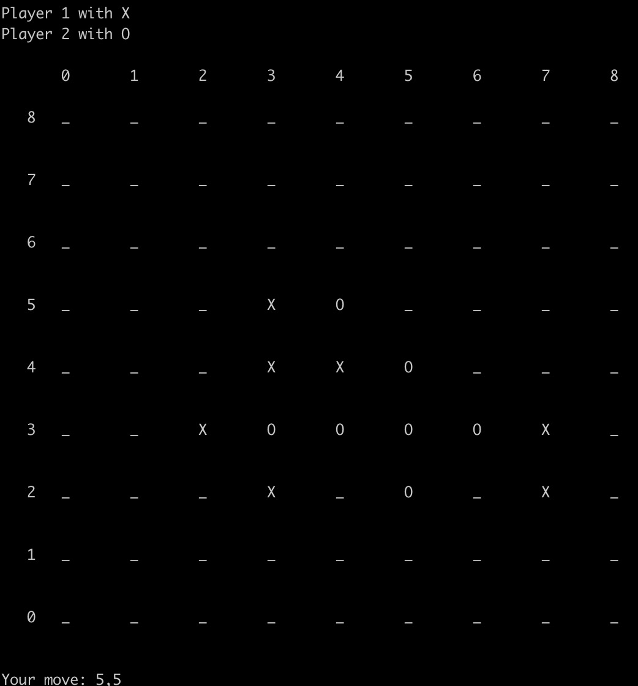

# 人工智能导论第一次作业-搜索实践

### 介绍

”[五子棋]((https://en.wikipedia.org/wiki/Gomoku))“是一款大家耳熟能详的游戏，本次作业需要结合课上学习的搜索相关知识，逐步实现一个无禁手五子棋Intelligent Agent :)

本次作业目标：
- 实现二人零和博弈最基本的minimax搜索
- 实现alpha-beta search等剪枝方法
- 设计评估函数并实现基于评估的截断搜索
- 实现蒙特卡洛搜索树 (MCTS) 搜索方法
- 了解AlphaZero的原理并进行基本尝试


### 文件结构

需要编辑的文件：

- minimax.py: 基于minimax的搜索方法实现。
- mcts.py: 基于mcts的搜索方法实现。
- alphazero.py: alphazero思想的实现。
- evaluation.py: 评估函数的实现。

需要阅读的文件：

- game.py: ```State```类型、```Board```类型、```Player```类型


### 使用说明

进入目录，输入以下命令运行五子棋游戏：

```
python play.py
```



游戏规则：通过键盘输入坐标 `A,B` 表示在第A行第B列落子，五子连珠即可获得胜利。

通过在指令中加入不同的参数，可以得到不同的棋盘大小以及获胜所需子数，具体地：
```
python play.py --width w --height h --n_in_row n
```
表示在 w$\times$h 的棋盘上以n子连珠为胜利。

代码中已经实现了一个最简单的```DummyPlayer```，它永远只会下在棋盘从上到下、从左到右第一个可以落子的位置。想要与AI进行对战，运行指令：
```
python play.py --player_1 Human --player_2 DummyPlayer
python play.py --player_1 DummyPlayer --player_2 Human
```
分别表示执先、后手与AI进行对战。

查看更详细的参数说明：
```
python play.py --help
```

#### 问题一 (5 points)

首先我们考虑一个简化版的问题：$w=h=n=3$，也就是我们常玩的井字棋。此时状态数比较小，因此可以通过完全搜索解决。你需要实现二人零和博弈中最基本的minimax搜索方法来寻找最优策略。

##### 作业要求
- 阅读```minimax.py```文件中的```MinimaxSearchPlayer```类，我们已经提供了部分框架及相应的注释，你需要实现核心部分内容。

##### 提示

- 请仔细阅读注释，并尽可能调用state对象的接口，你可以在game.py的State类找到相应接口。
- **建议统一将```MinimaxSearchPlayer```对应的玩家（```self._player```）作为最大值玩家 (max player)，而非将一号玩家作为最大值玩家**，这不仅是为了代码实现方便，更是为了与后续问题相照应。
- 搜索程序（尤其是不加剪枝的搜索程序）通常运行缓慢，若AI无响应，未必是死循环，可能需要耐心等待。
- 实现后，你可以运行以下命令，进行人机对战测试：
```
python play.py --width 3 --height 3 --n_in_row 3 --player_1 Human --player_2 MinimaxSearchPlayer
python play.py --width 3 --height 3 --n_in_row 3 --player_1 MinimaxSearchPlayer --player_2 Human
```
- 正确实现下，无论先后手如何，AI都应该找到一组必不输策略。

#### 问题二 (5 points)

尝试扩大问题规模：$w=4,h=n=3$，容易发现存在先手必胜策略。然而如果直接将朴素的minimax搜索应用其中，可能运行很久也没有搜索完毕。我们尝试用alpha-beta搜索进行剪枝。

##### 作业内容
- 阅读```minimax.py```文件中的```AlphaBetaSearchPlayer```类，并实现核心部分内容。
- 在$4\times 3$的棋盘上分别测试有无剪枝的搜索，并比较运行时间：
```
python play.py --width 4 --height 3 --n_in_row 3 --player_1 MinimaxSearchPlayer --player_2 Human
python play.py --width 4 --height 3 --n_in_row 3 --player_1 AlphaBetaSearchPlayer --player_2 Human
```

#### 问题三 (15 points)

现在考虑更实际的情况，比如 $w=h=9,n=5$。此时棋盘相对很大，并且没有平凡的必胜策略。你可以尝试直接调用问题一、二得到的AI：
```
python play.py --player_1 MinimaxSearchPlayer --player_2 Human
python play.py --player_1 AlphaBetaSearchPlayer --player_2 Human
```
由于搜索树太深，AI甚至无法做出第一步落子！因此必须做出一些“让步”：当深度较浅时，可以通过搜索充分考虑对手的行为逻辑；但是当深度较大时，受时间限制，不能继续搜索。为了体现出不同后继的差异，需要对状态进行**评估**，并进行截断搜索 (cutting off search)。

这里的评估需要基于五子棋的先验知识，比如：
- 落棋应当尽量落在正中间附近，防止被阻挡；
- 活三、冲四等棋型可以强迫对手进行一步防守;
- 活四等棋型对手无法防守，几乎获得胜利;

我们在```game.py```的```Board```类里**已经提供了**部分先验知识的提取，包括：
- 活四、冲四、活三、冲三、活二的数目
- 最远棋子距离棋盘中心的相对距离（最小为0，最大为1）

**你不需要复现或改进这部分代码，而是需要基于已经提取好的信息，设计一个合适的评估函数，并实现带评估函数的截断搜索**。代码中提供了```dummy_evaluation_func```和```distance_evaluation_func```作为参考。

你也可以基于评估函数进行其他剪枝，比如：对状态按照评估函数排序等等。

##### 作业要求
- 阅读```evaluation.py```中```Board```类的```get_info```函数，了解该函数的返回值，在```evaluation.py```中基于该函数设计评估函数，实现```detailed_evaluation_func```函数。这个函数输入一个状态，输出**即将行动的玩家**对这个状态的评估。可以参考同文件下的```dummy_evaluation_func```和```distance_evaluation_func```。
- 在```minimax.py```中补全基于```detailed_evaluation_func```评估函数的```CuttingOffAlphaBetaSearchPlayer```方法。你也可以尝试在方法中加入其他剪枝技巧。

##### 提示
- 建议将评估函数的取值固定到 $[-1,1]$ 之间，因为通常获胜得分为 $1$ 而失败得分为 $-1$ 。
- ```your_evaluation```的一种可能实现为：为每种棋型设置一个得分，用当前玩家的总得分减去对手的得分；你和对手的计分方法可以是非对称的，比如：你的冲四可以立即变为五连从而胜利，但是对手的冲四却可以被封堵等等。
- 实现后，运行以下命令与AI进行对战！
```
python play.py --player_1 CuttingOffAlphaBetaSearchPlayer --player_2 Human --max_depth 1 --evaluation_func detailed_evaluation_func
```
- 当```depth=1```时，如果实现正确，AI应当展现出一定的棋力，比如：会对活三、冲四进行封堵，会主动进攻等等。

#### 问题四 (15 points)

AlphaZero是继AlphaGo之后的又一力作，相比于AlphaGo需要基于大量人类棋谱进行训练，AlphaZero则是完全从零开始训练，仅仅通过自我对抗 (self-play) 的训练方式，就能够学习到超出人类的棋力水平。AlphaZero适用于种种不同的棋类游戏，成为了AI发展的重要标志。

在前三道题中，你或许已经体会到了传统基于minimax搜索的AI的局限性：搜索深度多大，复杂度爆炸，因此必须设计合适的评估函数，而这往往就成为了算法的瓶颈；相比之下，AlphaZero所使用的是**蒙特卡洛搜索树 (MCTS)** 与强化学习相结合的方法。这一方法逐渐加大深度，可以平衡探索与利用，相比于minimax搜索更加灵活，适合与深度学习方法相结合。

在此，你需要实现一个基础版本的MCTS，并感受其与minimax搜索的不同。

##### 作业要求
- 阅读```mcts.py```，并完成```TreeNode```和```MCTS```两个类。其中，```TreeNode```类记录了搜索树中每个节点的信息，需要完成节点UCB的计算（```get_ucb```）、基于UCB的选择（```select```）以及权值的更新（```update```）；```MCTS```类记录了整棵树的信息，需要完成基于随机策略的评估（```get_left_value```）。每个函数和变量的具体功能可以参考代码注释。
  - 需要注意的是，代码中有一处地方与课件上不同：代码中选择节点时会**固定选择权值最大的节点**。
- 实现完成后，尝试让两个AI进行对战，观察结果并简单分析：
```
python play.py --player_1 MCTSPlayer --player_2 CuttingOffAlphaBetaSearchPlayer --evaluation_func detailed_evaluation_func
python play.py --player_1 CuttingOffAlphaBetaSearchPlayer --player_2 MCTSPlayer --evaluation_func detailed_evaluation_func
```

##### 提示
- 建议将节点权值定义为**当前玩家（即将行棋的玩家）的权值**，这样在```select```时，参考子节点权值时应该取负号。你也可以尝试其他定义，但需要注意正负号与最大最小值的问题。

#### 问题五 (5 points)

你可能已经发现，朴素的MCTS效果并不好，且行棋较慢。这主要是由于在探索新节点时的**随机游戏**并不是一个很好的评估。AlphaZero使用深度网络来学习当前局面的评估函数（以及行棋的概率先验）。出于简化，我们并不使用深度学习，而是尝试将问题三得到的人工评估函数引入到MCTS中。

##### 作业要求
- 阅读```alphazero.py```，并完成```AlphaZeroMCTS```类，这个类继承自```MCTS```，你只需要将```get_leaf_value```函数中的随机游戏改成根据评估函数进行评估。
- 实现完成后，尝试让问题四和问题五的AI进行对战，观察加入评估函数后是否行棋更加合理：
```
python play.py --player_1 MCTSPlayer --player_2 AlphaZeroPlayer --evaluation_func detailed_evaluation_func
python play.py --player_1 AlphaZeroPlayer --player_2 MCTSPlayer --evaluation_func detailed_evaluation_func
```

##### 提示
- 如果效果始终不佳，你可以尝试较小的c值，比如`--c 0.1`

### 最终提交

* 代码部分(45 Points)：只需修改**minimax.py**, **mcts.py**, **alphazero.py**, **scoring.py**，**请不要修改项目中其他文件中的核心部分**。
* 文档部分(15 Points)，至少应包含如下内容：
  * 问题一：简单陈述AI的表现
  - 问题二：需要说明alpha-beta搜索相比朴素minimax快了多少
  - 问题三：需要说明评估函数的设计方案
  * 问题四：简述MCTS与alpha-beta搜索的对战结果并简单分析
  - 问题五：对比MCTS和AlphaZero，简述AlphaZero是否行棋更加合理

在项目中遇到任何问题，欢迎在课程微信群中讨论。
