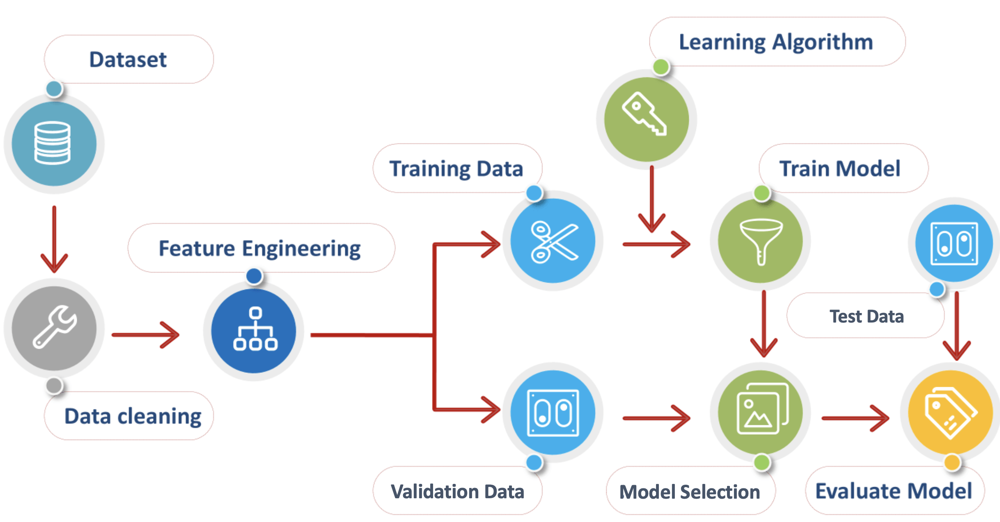

# 人工智能导论第二次作业-分类实践

### 介绍

我们在课上介绍了多种分类算法，如逻辑回归，决策树，支持向量机等。本次作业旨在让大家掌握使用机器学习进行数据挖掘的的技术栈，能够自主实现一些基础的机器学习算法，运用自己所学解决实际问题。


### 数据集

2022年11月，ChatGPT横空出世，以其惊艳的表现进一步证明了大模型在通用人工智能方面的潜力，引领了新一波大模型浪潮。相比于过去的GPT-3和GPT-3.5，ChatGPT主要加入了人类对话形式的指示学习和人工对生成结果进行排序的强化学习，证明了在大模型领域除了大量的无监督数据以外，适当引入人工知识也是非常必要的。在本次作业中，我们也从自然语言中的人工知识出发，解决人类对文本的情感分析问题。

本次作业使用的[数据集](./data/sentiment_train.csv)是推特的情感分析数据集。给定一段文本和一个实体，我们的任务是判断文本对实体的情感。在这个数据集中有四个类别：正面(Positive)、负面(Negative)、中立(Neutral)和无关(Irrelevant)。我们需要从文本中提取特征，并进行后续的分类。


### 流程概述

一般来说，使用机器学习模型进行数据挖掘的流程示意如下。借助此图，可将这次实践大致划分为四个部分：



#### 数据处理

在这一步中，我们需要读取并处理数据。例如：
- 清洗数据，进行必要的格式转换
- 对数据进行特征工程，提取用于模型推理的特征

#### 模型实现

课上我们已经学习了诸多分类模型，不同模型基于的假设不同，在同一数据上的表现也不同。我们鼓励大家：
- 借助成熟的工具库，了解实际应用中常会出现的模型，尝试它们的效果
- 能够模仿这些模型的接口，自己实现一些简单的模型

#### 模型选择

我们在训练数据上训练模型的最终目标是为了提高在训练时未见过的测试数据上的效果。为此，我们需要选择合适的模型并设置一组好的超参数，进行选择的方法如：
- 交叉验证：将训练数据按比例划分为训练集和验证集，使用训练集训练模型，在验证集上测试模型的效果，最终选择在验证集上分类准确率最高的模型
- 你也可以尝试K折交叉验证等方式进行模型选择

#### 测试评估

使用选出的最佳模型，最后在测试数据上进行模型评估

### 作业要求

#### 评分 (40 Points)

* 代码 (25 Points)
  * 我们给大家提供了大部分代码框架，运行前需要安装必要的库，命令为 ```pip install -r requirements.txt```，请仔细阅读```playground.ipynb```，根据要求实现相关代码或汇报实验结果（已标注**TODO**）
  * 以Python代码或Jupyter Notebook的形式提交，要求代码逻辑清晰，注释清楚，可读性较好
* 文档 (15 Points)
  * 详见**TODO**说明中的**requirements**

如果大家在项目中遇到任何问题，欢迎在课程微信群中讨论 。


### 参考教程

* Jupyter Notebook教程：https://zhuanlan.zhihu.com/p/75402607
* numpy矩阵运算：https://www.numpy.org.cn/reference/
* pandas数据处理：https://pandas.pydata.org/docs/getting_started/intro_tutorials/
* scikit-learn库：https://scikit-learn.org/stable/index.html


